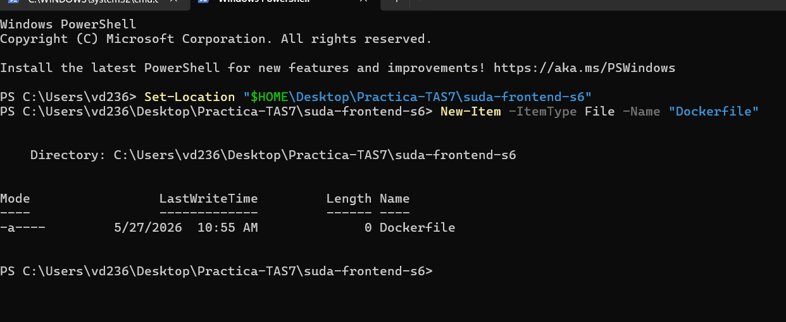
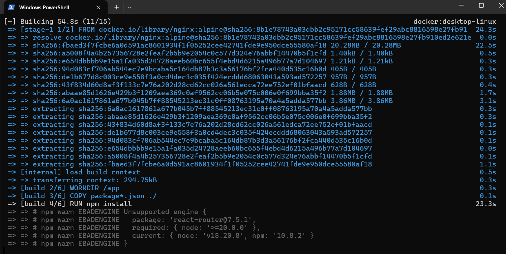

# Práctica servidor web

## 1. Título
**Generar una imagen Docker a partir de una aplicación React disponible en el siguiente repositorio**


## 2. Tiempo de duración
120 minutos.


## 3. Fundamentos

La contenedorización es una tecnología de virtualización a nivel de sistema operativo que permite empaquetar una aplicación junto con todo su entorno de ejecución (código, dependencias, bibliotecas y archivos de configuración) en una única entidad aislada llamada contenedor. A diferencia de las máquinas virtuales tradicionales, los contenedores no incluyen un sistema operativo completo integrado; en su lugar, comparten el núcleo (*kernel*) del sistema operativo anfitrión. Esto los hace extremadamente ligeros, rápidos de iniciar y altamente eficientes en el consumo de recursos como memoria RAM y espacio en disco.

La plataforma Docker se ha consolidado como el estándar de la industria para la creación y gestión de estos entornos. Su arquitectura se basa en un modelo cliente-servidor, donde el cliente Docker se comunica con el demonio de Docker (*Docker Daemon*), el cual se encarga de construir, ejecutar y distribuir los contenedores. Los tres pilares fundamentales de este ecosistema son el Dockerfile, las imágenes y los contenedores:

- **Dockerfile:** Es un archivo de texto plano sin extensión que contiene un conjunto secuencial de instrucciones y comandos declarativos. El motor de Docker lee este archivo de forma automática para ensamblar una imagen paso a paso.
- **Imagen Docker:** Es una plantilla de solo lectura que funciona como un plano o “snapshot” empaquetado de la aplicación. Contiene el código fuente, los entornos de ejecución (como Node.js) y las herramientas necesarias para que el software funcione.
- **Contenedor:** Es la instancia viva, ejecutable y en tiempo de ejecución de una imagen. Se pueden crear, arrancar, detener o borrar múltiples contenedores basados en una misma imagen original.

En el desarrollo de aplicaciones modernas del lado del cliente (como las *Single Page Applications* construidas con React), Docker resuelve el clásico problema de “en mi máquina sí funciona”. Al encapsular la versión exacta del entorno de ejecución (Node.js Alpine) dentro de la imagen, se garantiza un comportamiento idéntico del software tanto en el entorno de desarrollo local del estudiante como en los servidores de producción o evaluación del docente.


## 4. Conocimientos previos

Para realizar esta práctica de forma exitosa, el estudiante necesita tener claros los siguientes temas:

- **Comandos de consola de Windows (PowerShell):** Navegación por directorios (`Set-Location`), creación de archivos (`New-Item`) y administración de variables de entorno.
- **Manejo del sistema de control de versiones Git:** Clonación de repositorios públicos mediante terminal (`git clone`).
- **Fundamentos de redes e infraestructura:** Comprensión de la arquitectura Cliente-Servidor, direccionamiento IP local (`localhost`) y mapeo/redireccionamiento de puertos de red (`-p puerto_host:puerto_contenedor`).
- **Estructura de proyectos JavaScript:** Familiaridad con el gestor de paquetes de Node (`npm`), archivos de configuración `package.json` y los scripts de inicialización de entornos SPA.


## 5. Objetivos a alcanzar

- Implementar contenedores locales utilizando la plataforma Docker Desktop en un entorno Windows adaptado con WSL2.
- Manipular y estructurar archivos de configuración declarativos (`Dockerfile`) adaptados a los requerimientos específicos de un proyecto en React.
- Construir imágenes personalizadas de Docker de forma local a partir del contexto de un repositorio clonado.
- Desplegar un contenedor web accesible desde el navegador del sistema anfitrión mediante el correcto direccionamiento y mapeo de puertos.


## 6. Equipo necesario

- Computador personal con sistema operativo Windows 11.
- Entorno de emulación Windows Subsystem for Linux (WSL 2.7.3 instalado y actualizado).
- Motor de contenedores Docker Desktop v4.71.0 operativo con permisos elevados de administrador.
- Terminal de comandos Windows PowerShell.
- Navegador web moderno (Google Chrome / Microsoft Edge).


## 7. Material de apoyo

- Documentación oficial de Docker Setup para Windows (docs.docker.com).
- Guía de comandos de Windows Subsystem for Linux (learn.microsoft.com).
- Repositorio público del Frontend en React:
  `https://github.com/Daviddotcoms/suda-frontend-s6`
- Repositorio público de la API de simulación:
  `https://github.com/Daviddotcoms/mockAPI`


# 8. Procedimiento

## Paso 1: Preparación del entorno de trabajo

Se abrió la terminal de Windows PowerShell y se procedió a crear un directorio limpio en el escritorio del sistema llamado `Practica-TAS7` para clonar el proyecto frontend de React mediante Git. Seguidamente, se accedió a la carpeta raíz del proyecto y se generó un archivo vacío denominado `Dockerfile`.

```powershell
Set-Location "$HOME\Desktop\Practica-TAS7\suda-frontend-s6"
New-Item -ItemType File -Name "Dockerfile"
```




## Paso 2: Configuración e inicialización del motor Docker y WSL2

Se procedió con la instalación de Docker Desktop ejecutando el instalador con privilegios elevados de Administrador. Tras inicializar la aplicación, el sistema solicitó la actualización del núcleo de emulación de Linux. Se otorgó el consentimiento en la consola nativa de WSL para descargar e instalar los paquetes complementarios correspondientes de Microsoft de forma exitosa.

```powershell
wsl --update
```


## Paso 3: Declaración de instrucciones en el Dockerfile

Debido a las características estructurales del framework del proyecto clonado, se insertaron las directivas de construcción dentro del archivo Dockerfile utilizando PowerShell, configurando un entorno basado en Node.js Alpine para exponer la aplicación de desarrollo de manera directa en el puerto interno 3000.

```powershell
Set-Content -Path "Dockerfile" -Value @'
FROM node:18-alpine
WORKDIR /app
COPY package*.json ./
RUN npm install
COPY . .
EXPOSE 3000
CMD ["npm", "start"]
'@
```


## Paso 4: Construcción de la imagen personalizada

Con el motor de Docker Desktop en estado activo (*Engine Running*), se ejecutó el comando de compilación local para generar la imagen personalizada denominada `suda-frontend:v1`, procesando de forma exitosa la descarga de capas de Node y la instalación de los paquetes mediante `npm install`.

```powershell
docker build -t suda-frontend:v1 .
```




## Paso 5: Despliegue del contenedor web

Una vez finalizada la construcción de la imagen sin errores, se inicializó el contenedor en segundo plano asignándole el nombre descriptivo `app-frontend-contenedor` y mapeando el puerto de escucha 3000 interno hacia el puerto público 8080 de la máquina host local.

```powershell
docker run -d --name app-frontend-contenedor -p 8080:3000 suda-frontend:v1
```


# 9. Resultados esperados

El resultado exitoso de la práctica se valida al comprobar el aislamiento del contenedor y la exposición del servidor web local. Al abrir el navegador web del sistema anfitrión e ingresar a la URL `http://localhost:8080`, el contenedor Docker procesa la solicitud de forma nativa y despliega la interfaz gráfica de la aplicación React de manera fluida, confirmando el estado activo con el mensaje en pantalla:

> "Server is up and running"


# 10. Bibliografía

Docker Documentation. (2026). *Docker Desktop for Windows user guide.* Recuperado de:  
https://docs.docker.com/desktop/setup/install/windows-install/

Microsoft Learn. (2026). *Basic commands for WSL.* Microsoft Corporation. Recuperado de:  
https://learn.microsoft.com/en-us/windows/wsl/basic-commands

React Open Source. (2025). *Deployment and Containerization for Single Page Applications.* React Docs.
